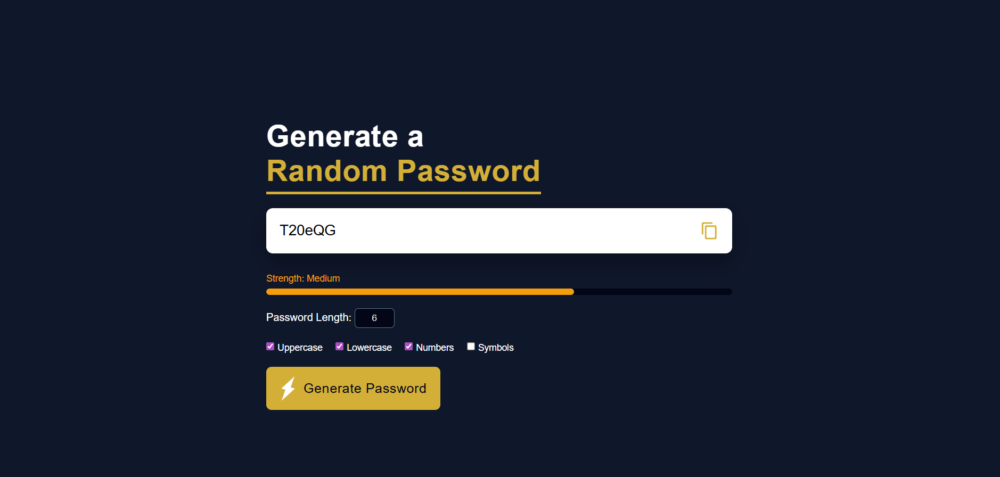

# Random Password Generator 🔐

Random Password Generator is a simple web application that allows users to generate strong and secure passwords.
Users can customize the password length and choose which character types to include, such as uppercase letters,
lowercase letters, numbers, and symbols.

The application also provides a password strength indicator that shows whether the generated password is
weak, medium, or strong, helping users create safer passwords.

---

## Screenshot

The following screenshot shows the main interface of the application, including the password generator options,
strength indicator, and copy-to-clipboard feature.

---

## How It Works

1. Enter the desired password length.
2. Select the character types you want to include.
3. Click the **Generate Password** button.
4. Check the password strength indicator.
5. Use the **Copy** button to copy the password.

---

## Technologies Used

- HTML
- CSS
- JavaScript
